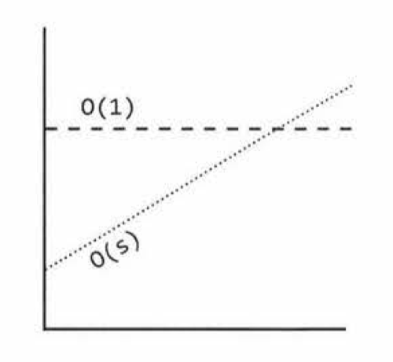
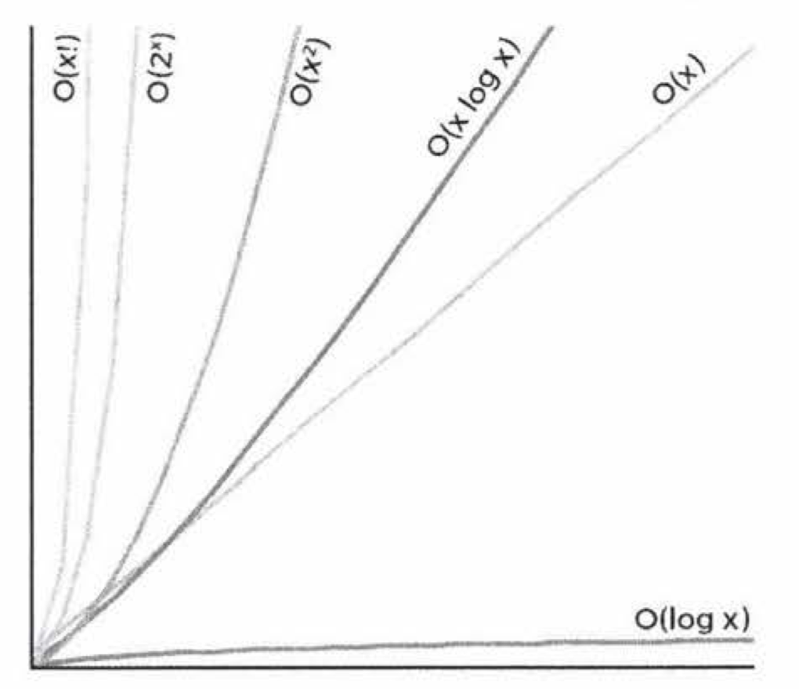
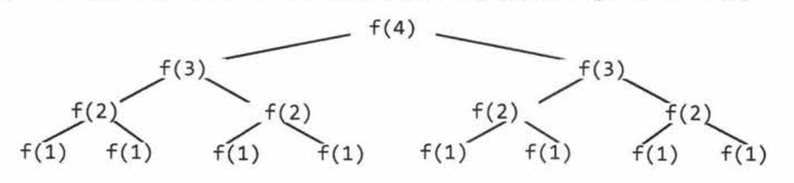

## Big O
- Big 0 time is the language and metric we use to describe the efficiency of algorithms.
- Imagine the following scenario: You've got a file on a hard drive and you need to send it to your friend who lives across the country.
  - Electronic Transfer: `O(s)`, where s is the size of the file. 
  - Airplane Transfer: `O(1)` with respect to the size of the file. As the size of the file increases, it won't take any longer to get the file to your friend. The time is constant.
   
- Those times when you're confused about the runtime and so you want to take a guess-those are the times when you're most likely to have a non-obvious and less common runtime. Derive, don't guess.
***
- Terms
  - O (big O): In academia, big 0 describes an **upper bound** on the time. A simple algorithm to print the values in an array is O(N) as well as $O(N^3)$ or any runtime bigger than O(N) .
  - $\Omega$ (big omega): In academia, $\Omega$ for **lower bound**. Printing the values in an array is $\Omega(N)$ as well as $\Omega(\log{N})$ and $\Omega(1)$.
  - $\theta$ (big theta): In academia,$\theta$0 means both O and $\Omega$. That is, an algorithm is $\theta(N)$ if it is both $O(N)$ and $\Omega(N)$. $\theta$ gives a **tight bound** on runtime.
  - **In industry, people seem to have merged O and $\theta$ together.** Industry's meaning of big O is closer to what academics mean by $\theta$.
***
- Cases
  - Quick sort picks a random element as a "pivot" 
    - Best Case: If all elements are equal, then quick sort will, on average, just traverse through the array once. This is O(N).
    - Worst Case: If the pivot is chosen to be the first element in the subarray and the array is sorted in reverse order, this will degenerate to an $O(N^2)$ runtime.
    - Expected Case: Usually, these wonderful or terrible situations won't happen. We can expect a runtime of $O(N\log{N})$.
  - We rarely ever discuss best case time complexity, because it's not a very useful concept.
***
- Space Complexity
  - Time is not the only thing that matters in an algorithm.
  - We might also care about the amount of memory required by an algorithm.
  ```java
  int sum(int n) {
    if (n <= 0) {
      return 0;
    }
    return n + sum(n-1);
  }
  ``` 
  - This code take $O(n)$ time and $O(n)$ space.
  - sum(4) -> sum(3) -> sum(2) -> sum(1) -> sum(0). Each of these calls is added to the call stack and takes up actual memory.
  ```java
  int pairSumSequence(int n) {
    int sum = 0;
    for (int i = 0; i < n; i++) {
      sum += pairSum(i, i+1);
    }
    return sum;
  }

  int pairSum(int a, int b) {
    return a + b;
  }
  ``` 
  - There will be roughly O(n) calls to pairSum.
  - However, those calls do not exist simultaneously on the call stack, so you only need $O(1)$ space.
***
- Drop the Constants
  - Big O just describes the rate of increase. For this reason, we drop the constants in runtime.
  - An algorithm that one might have described as O(2N) is actually O(N).
  ```java
  int min = Integer.MAX_VALUE;
  int max = Integer.MIN_VALUE;
  for (int x : array) {
    if (x < min) min = x;
    if (x > max) max = x;
  }
  ``` 

  ```java
  int min = Integer.MAX_VALUE;
  int max = Integer.MIN_VALUE;
  for (int x : array) {
    if (x < min) min = x;
  }

  for (int x : array) {
    if (x > max) max = x;
  }
  ``` 
  - If you're going to count the number of instructions, then you'd have to go to the assembly level.
  - How the compiler would optimize something, and all sorts of other details.
  - Big O allows us to express how the runtime roughly scales.
  - We just need to accept that **it doesn't mean that O(N) is always better than $O(N^2)$.**
- Drop the Non-Dominant Terms
  - For $O(N^2 + N)$, the second N is, compared to the $N^2$, not especially important. Therefore, $O(N^2 + N)$ would be $O(N^2)$
   
  - We drop the non-determinant Terms
    - $O(N^2+N)$ becomes $O(N^2)$
    - $O(N+\log{N})$ becomes $O(N)$
    - $O(5\times2^N + 1000N^{100})$ becomes $O(2^N)$
  - There lots pf runtime worse than $O(x!)$, such as $O(x^x)$ or $O(2^x\times{x!})$

## Evaluate Big O
- Add vs Multiply
  - When do you multiply the runtimes and when do you add them?
  ```java
  // O(A + B)
  for (int a : arrA) {
    print(a);
  }

  for (int b : arrB) {
    print(b);
  }
  ``` 
  ```java
  // O(AB)
  for (int a : arrA) {
    for (int b : arrB) {
      print(a + "," + b);
    }
  }
  ```
  - If your algorithm is in the form "**do this, then,** when you're all done, do that" then you add the runtimes.
  - If your algorithm is in the form "**do this for each time** you do that" then you multiply the runtimes.
***
- Amortized Time
  - An `ArrayList` is implemented with an array. When the array hits capacity, the `ArrayList` class will **create a new array with double the capacity and copy all the elements** over to the new array.
  - If the array contains N elements and is full, then inserting a new element will take $O(N)$ time.
    - However, we also know that this doesn't happen very often.
    - The vast majority of the time insertion will be in 0(1) time since it happens only after N insertion.
  - Amortized Time allows us to describe that **worst case happens every once in a while**.
***
- Log N Runtimes
  - Where does $\log{N}$ come from?
  - In binary search, we are looking for an example x in an N-element sorted array
    - Algorithm
      - We start off with an N-element array to search. 
      - Then, after a single step, we're down to $\frac{N}{2}$ elements.
      - One more step, and we're down to $\frac{N}{4}$ elements.
      - We stop when we either find the value or we're down to just one element.
    - The total runtime is then a matter of how many steps we can take
      - N = 16
      - N = 8
      - N = 4
      - N = 2
      - N = 1
    - We take 4 steps to find the answer
      - $2^4 = 16$
      - $\log{16} = 4$
  - When you see a problem where the number of elements in **the problem space gets halved each time**, that will likely be a $O(\log_2{N})$ runtime.
  - The base of the log doesn't matter for the purposes of big O.
***
- Recursive Runtimes
  ```java
  int f(int n) {
    if (n <= 1) {
      return 1;
    }

    return f(n-1) + f(n-1);
  }
  ```
  
  - The tree will have depth N. Each node has two children.

  | Level | #Nodes | Also expressed as ...                  |
  |-------|--------|----------------------------------------|
  |   0   |    1   |                                        |
  |   1   |    2   | 2 * previous level = 2                 |
  |   2   |    4   | 2 * previous level = $2 * 2^1 = 2^2$   |
  |   3   |    8   | 2 * previous level = $2 * 2^2 = 2^3$   |
  |   4   |   16   | 2 * previous level = = $2 * 2^3 = 2^4$ | 

  - There will be $2^0 + 2^1 + 2^2 + ... + 2^N = 2^{N+1} - 1$ nodes.
  - When you have a **recursive function that makes multiple calls**, the runtime will often look like $O(\text{branch}^\text{depth})$.
  - Although we have $O(2^N)$ nodes in the tree total, only N exist at any given time. Therefore, we would **only need to have $O(N)$ memory** available.

## Examples
1. Example 1
    ```java
    void foo(int[] array) {
      int sum = 0;
      int product = 1;
      for (int i = 0; i < array.length; i++) {
        sum += array[i];
      }
      for (int i = 0; i < array.length; i++) {
        product *= array[i];
      }

      System.out.println(sum + ", " + product);
    }
    ```
    - This will take $O(N)$ time.
 
2. Example 2 
    ```java
    void printParis(int[] array) {
      for (int i = 0; i < array.length; i++) {
        for (int j = 0; j < array.length; j++) {
          System.out.println(array[i] + ", " + array[j]);
        }
      }
    }
    ```
    - The inner for loop has $O(N)$ iterations and it is called N times. Therefore, the runtime is $O(N^2)$
    - The code is to print all pairs. There are $O(N^2)$ pairs; therefore, the runtime is $O(N^2)$.
3. Example 3
    ```java
    void printUnorderedPairs(int[] array) {
      for (int i = 0; i < array.length; i++) {
        for (int j = i + 1; j < array.length; j++) {
          System.out.println(array[i] + ", " + array[j]);
        }
      }
    }
    ```
    - Deep comprehension is important.
    - Counting iterations
      - The first time through j runs for $N-1$ steps. The second time, it's $N-2$ steps. Then $N-3$ steps. And so on.
      - The total steps is $(N-1)+(N-2)+(N-3)+\dotsc+2+1 = \frac{N(N-1)}{2}$
      - Thus, the runtime is $O(N^2)$
    - What is means
      - The code means to iterates through each pair of values for (i, j) where j is bigger than i.
      - There are $N^2$ total pairs. Roughly half of those will have i < j and the remaining half will have i > j.
      - Therefore, this code goes through $\frac{N^2}{2}$ pairs so it does $O(N^2)$ work.
      - Visualize what is does
        ```java
        (0, 1 ) (0, 2) (0, 3) (0, 4) (0, 5) (0, 6) (0, 7)
                (1, 2) (1, 3) (1, 4) (1, 5) (1, 6) (1, 7)
                      (2, 3) (2, 4) (2, 5) (2, 6) (2, 7)
                              (3, 4) (3, 5) (3, 6) (3, 7)
                                    (4, 5) (4, 6) (4, 7)
                                            (5, 6) (5, 7)
                                                  (6, 7)
        ``` 
        - This looks like half of an NxN matrix, which has size $\frac{N^2}{2}$. Therefore, it takes $O(N^2)$ time.
      - 
    - Average Work
      - We know that the outer loop runs N times.
      - The average work of inner loop is $\frac{(1+2+\dotsc+10)}{10} = 5$
      - The average value in this sequence is $\frac{N}{2}$.
      - Therefore, since the inner loop does $\frac{N}{2}$ work on average and it is run N times, the total work is $\frac{N^2}{2}$ which is $O(N^2)$.
4. Example 4
    ```java
    void printUnorderedPairs(int[] arrayA, int[] arrayB) {
      for (int i = 0; i < arrayA.length; i++) {
        for (int j = 0; j < arrayB.length; j++) {
          if (arrayA[i] < arrayB[j]) {
            System.out.println(arrayA[i] + ", " + arrayB[j]);
          }
        }
      }
    }
    ```
    - The if-statement within j's for loop is O(1).
    - The run time is $O(ab)$, a = arrayA.length, b = arrayB.length.
5. Example 5
    ```java
    void printUnorderedPairs(int[] arrayA, int[] arrayB) {
      for (int i = 0; i < arrayA.length; i++) {
        for (int j = 0; j < arrayB.length; j++) {
          for (int k = 0; k < 100000; k++) {
            System.out.println(arrayA[i] + ", " + arrayB[j]);
          }
        }
      }
    }
    ```
    - 100,000 units of work is still constant.
    - The run time is $O(ab)$.
6. Example 6
    ```java
    void reverse(int[] array) {
      for (int i = 0; i < array.length / 2; i++) {
        int other = array.length - i - 1;
        int temp = array[i];
        array[i] = array[other];
        array[other] = temp;
      }
    }
    ```
    - It only goes through half of the array, and it doesn't impact the big O time.
    - The algorithm runs in $O(N)$ time.
7. Example 7
   - Which of the following are equivalent to O(N)?
     - O(N + P), where $P < \frac{N}{2}$
     - O(2N)
     - O(N + \log{N})
     - O(N + M)
   - If $P < \frac{N}{2}$, then we know that N is the dominant term.
   - There us no established relationship between $N, M$. Thus, it is not equivalent to O(N).
8. **Example 8**
   - Suppose we had an algorithm that took in an array of strings, sorted each string, and then sorted the full array.
   - Wrong: The problem is that *we used N in two different ways*
     - Sorting each string is $O(N\log{N})$
     - We have to do this for each string, so that's $O(N*N\log{N})$
     - We also have to sort this array, so that's an additional $O(N\log{N})$ work.
     - The total runtime is $O(N^2\log{N} + N\log{N})$, which is just $O(N^2\log{N})$.
   - Correct
     - Define new terms
       - Let $s$ be the length of the longest string.
       - Let $a$ be the length of the array.
     - Sorting each string is $O(s\log{s})$.
     - We have to do this for every string, so that's $O(as\log{s})$.
     - Now we have to sort all the strings. Each string comparison takes $O(s)$ time. There are $O(a\log{a})$ comparisons. This takes $O(as\log{a})$ time.
     - Add up these two parts, you get $O(as\log{s} + as\log{a}) = O(as(\log{s}+\log{a}))$
9. Example 9
   - The nodes are in a balanced binary tree.
   ```java
   int sum(Node node) {
     if (node == null) {
       return 0;
     }
     return sum(node.left) + node.value + sum(node.right);
   }
   ```
   - Just because it's **a binary search tree doesn't mean that there is a log in it**.
   - What is means
     - This code touches each node in the tree once.
     - Every touch does a constant time amount of work.
     - The runtime is $O(N)$
   - Recursive Pattern
     - A recursive function with multiple branches is typically $O(\text{branches}^\text{depth})$.
     - For a binary search tree having N node, its depth is $\log{N}$
     - The runtime is $O(2^{\log{N}}) = O(N)$
       - $2^{\log{N}} = x$
       - $\log{N} = \log{x}$
       - Thus, $x = N$, and $2^{\log{N}} = x = N$
10. Example 10
    ```java
    boolean isPrime(int n) {
      for (int x = 2; x * x <= 2; x++) {
        if (n % x == 0) {
          return false;
        }
      }

      return false;
    }
    ``` 
    - It only needs to go up to the square root of n.
    - The work inside the for loop is constant.
    - The for loop will start when x = 2 and end when x*x = n. Or, in other words, it stops when $x = \sqrt{n}$
    - The runtime is $O(\sqrt{n})$
11. Example 11
    ```java
    int factorial(int n) {
      if (n < 0) {
        return -1;
      } else if (n == 0) {
        return 1;
      } else {
        return n * factorial(n - 1);
      }
    }
    ```
    - This is just a straight recursion from n to n -1 to n - 2 down to 1.
    - It take O(n) time
12. **Example 12**
  ```java
  void permutation(String str) {
    permutation(str, "");
  }

  void permutation(String str, String prefix) {
    if (str.length() == 0) {
      System.out.println(prefix);
    } else {
      for (int i=0; i < str.length(); i++) {
        String rem = str.substring(0, i) + str.substring(i + 1);
        permutation(rem, prefix + str.chatAt(i));
      }
    }
  }
  ```
  - How many times does permutation get called in its base case?
    - Suppose we had 7 characters in the string, he total number of permutation is 7 * 6 * 5 * 4 * 3 * 2 * 1
    - **Permutation is called n! times** in its base case (when prefix is the full permutation).
  - How many times does permutation get called before its base case?
    - We need to consider how many times a permutation executes `for (int i=0; i < str.length(); i++)` line (from "" to the permutation).
    - Each leaf is attached to a path of length n.
    - There are n! leaves.
    - Therefore, we know there will be **no more than** $n*n!$ nodes (function calls).
  - How long does each function call take?
    - `System.out.println(prefix);` takes O(n) time since each character needs to be printed.
    - `str.substring(0, i) + str.substring(i + 1)` also take O(n) time combined, due to the string concatenation.
  - What is the total runtime?
    - The total runtime will not exceed $O(n^2n!)$.
    - We can derive a tighter runtime equation, but this would almost certainly be beyond the scope of any normal interview.
13. Example 13
  ```java
  int fib(int n) {
    if (n <= 0) return 0;
    else if (n == 1) return 1;
    return fib(n - 1) + fib(n - 2);
  }
  ```
  - We use recursive calls' pattern: $O(\text{branches}^\text{depth})$
  - The runtime is $O(2^N)$
  - Precise answer
    - The runtime is $O(1.6^N)$
    - At the bottom of the call stack, there is sometimes only one call.
    - Saying $O(2^N)$ would suffice for the scope of an interview, though you might get "bonus points" if you can recognize that it'll actually be less than that.
14. **Example 14**
  ```java
  void allFib(int n) {
    for (int i = 0; i < n; i++) {
      System.out.println(i + ": " + fib(i));
    }
  }

  int fib(int n) {
    if (n <= 0) return 0;
    else if (n == 1) return 1;
    return fib(n - 1) + fib(n - 2);
  }
  ```
  - Wrong: $O(n2^n)$
  - The error is n is changing.
    - fib(1) -> $2^1$ steps
    - fib(2) -> $2^2$ steps
    - fib(3) -> $2^3$ steps
    - fib(4) -> $2^4$ steps
    - ...
    - fib(n) -> $2^n$ steps
  - The total steps is $2^1 + 2^2 + ... + 2^n = 2^{n+1} - 2$. Thus, the runtime is $O(2^n)$
15. Example 15
  ```java
  void allFib(int n) {
    int[] memo = new int[n + 1];
    for (int i = 0; i < n; i++) {
      System.out.println(i + ": " + fib(i, memo));
    }
  }

  int fib(int n, int[] memo) {
    if (n <= 0) return 0;
    else if (n == 1) return 1;
    else if (memo[n] < 0) return memo[n];

    memo[n] = fib(n - 1, memo) + fib(n - 2, memo);
    return memo[n];
  }
  ```
  - Step by step
    - fib(0) -> return 0
    - fib(1) -> return 1
    - fib(2)
      - fib(1) -> return 1
      - fib(0) -> return 0
      - store 1 at memo[2]
    - fib(3)
      - fib(2) -> lookup memo[2] -> return 1
      - fib(1) -> return 1
      - store 2 at memo[3]
     - fib(4)
      - fib(3) -> lookup memo[3] -> return 2
      - fib(2) -> lookup memo[3] -> return 1
      - store 3 at memo[3]
  - The runtime is $O(n)$
  - This technique, called **memoization**, is a very **common one to optimize exponential time recursive algorithms**.
16. Example 16
  ```java
  int powerOf2(int n) {
    if (n < 1) {
      return 0;
    } else if (n == 1) {
      System.out.println(1);
      return 1;
    } else {
      int prev = powerOf2(n / 2);
      int curr = prev * 2;
      System.out.println(curr);
      return curr;
    }
  }
  ```
  - What it does?
    - powersOf2(50)
      - powersOf2(25)
        - powersOf2(12)
          - powersOf2(6)
            - powersOf2(3)
              - powersOf2(1)
                - print & return 1
              - print & return 2
            - print & return 4
          - print & return 8
        - print & return 16
      - print & return 32
    - We can divide 50 (or n) by 2 until we get down to the base case.
    - The runtime is $O(\log{n})$
  - What it means?
    - The code is supposed to be computing the powers of 2 from 1 through n.
    - If the algorithm prints 13 values at the end, then `powersOf2` was called 13 times.
    - In this case, we are told that it prints all the powers of 2 between 1 and n.
    - There are $\log{N}$ powers of 2 between 1 and n. Therefore, the runtime is $O(\log{n})$.
  - Rate of increase
    - If N goes from P to P+1, the number of calls to `powersOf2` might not change at all.
    - Each time n doubles, the number of calls to `powersOf2` increases by 1.
    - The number of calls to `powersOf2` is the number of times you can double 1 until you get n. It is x in the equation $2^x = n$
    - The value of x is $\log{n}$. Therefore, the runtime is $O(\log{n})$.

## Problems
1. The following code computes the product of a and b. What is its runtime?
  ```java
  int product(int a, int b) {
    int sum = 0;
    for (int i = 0; i < b; i++) {
      sum += a;
    }
    return sum;
  }
  ```
  - The runtime is O(b).
2. The following code computes $a^b$. What is its runtime?
  ```java
  int power(int a, int b) {
    if (b < 0) {
      return 0; // error
    } else if (b == 0) {
      return 1;
    } else {
      return a * power(a, b - 1);
    }
  }
  ```
  - The runtime is O(b).
3. The following code computes a % b. What is its runtime?
  ```java
  int mod(int a, int b) {
    if (b <= 0) {
      return - 1;
    }
    int div = a /b;
    return a - div * b;
  }
  ```
  - The runtime is O(1).
4. The following code performs integer division.  What is its runtime (assume a and b are both positive)?
  ```java
  int div(int a, int b) {
    int count = 0;
    int sum = b;
    while (sum <= a) {
      sum += b;
      count++;
    }
    return count;
  }
  ```
  - The runtime is $O(\frac{a}{b})$.
5. The following code computes the [integer] square root of a number. If the number is not a perfect square (there is no integer square root), then it returns -1 .It does this by successive guessing. If n is 100, it first guesses SO. Too high? Try something lower - halfway between 1 and SO. What is its runtime?
  ```java
  int sqrt(int n) {
    return sqrt_helper(n, 1, n);
  }

  int sqrt_helper(int n, int min, int max) {
    if (max < min) return -1; // no square root

    int guess = (min + max) / 2;
    if (guess * guess == n) { // found it
      return guess;
    } else if (guess * guess < n) { // too low
      return (sqrt_helper, guess + 1, max); // try higher
    } else {
      return (sqrt_helper, min, guess - 1); // try lower

    }
  }
  ```
  - The runtime is $O(\log{n})$.
6. The following code computes the [integer] square root of a number. If the number is not a perfect square (there is no integer square root), then it returns -1. It does this by trying increasingly large numbers until it finds the right value (or is too high). What is its runtime?
  ```java
  int sqrt(int n) {
    for (int guess = 1; guess * guess <= n; guess++) {
      if (guess * guess == n) {
        return guess;
      }
    }
    return -1;
  }
  ```
  - The runtime is $O(\sqrt{n})$.
7. If a binary search tree is not balanced, how long might it take (worst case) to find an element in it?
  - The runtime is $O(n)$.
8. You are looking for a specific value in a binary tree, but the tree is not a binary search tree. What is the time complexity of this?
  - The runtime is $O(n)$.
9. The `appendToNew` method appends a value to an array by creating a new, longer array and returning this longer array. You've used the appendToNew method to create a copyArray function that repeatedly calls appendToNew. How long does copying an array take?
  ```java
  int[] copyArray(int[] array) {
    int[] copy = new int[0];
    for (int value : array) {
      copy = appendToNew(copy, value);
    }
    return copy;
  }

  int[] appendToNew(int[] array, int value) {
    // copy all elements over to new array
    int[] bigger = new int[array.length + 1];
    for (int i = 0; i < array.length; i++) {
      bigger[i] = array[i];
    }

    // add new element
    bigger[bigger.length - 1] = value;
    return bigger;
  }
  ```
  - The runtime is $O(n^2)$
10. The following code sums the digits in a number. What is its big 0 time?
  ```java
  int sumDigits(int n) {
    int sum = 0;
    while (n < 0) {
      sum += n % 10;
      n /= 10;
    }
    return sum;
  }
  ```
  - The runtime is $O(\log{n})$
11. The following code prints all strings of length k where the characters are in sorted order. It does this by generating all strings of length k and then checking if each is sorted. What is its runtime?
  ```java
  int numChars = 26;

  void printSortedStrings(int remaining) {
    printSortedStrings(remaining, "");
  }

  void printSortedStrings(int remaining, String prefix) {
    if (remaining == 0) {
      if (isInOrder(prefix)) {
        System.out.println(prefix);
      }
    } else {
      for (int i = 0; i < numChars; i++) {
        char c = ithLetter(i);
        printSortedStrings(remaining - 1, prefix + c);
      }
    }
  }

  boolean isInOrder(String s) {
    for (int i = 1; i < s.length(); i++) {
      int prev = ithLetter(s.charAt(i - 1));
      int curr = ithLetter(s.charAt(i));
      if (prev > curr) {
        return false;
      }
    }
    return true;
  }

  char ithLetter(int i) {
    return (char)(((int)'a') + i);
  }
  ```
  - The runtime is $O(k26^k)$ or $O(kc^k)$, c denotes the number of characters in the alphabet.
    - $O(c^k)$ time to generate each string.
    - $O(k)$ time to check that each of these is sorted.
12. The following code computes the intersection (the number of elements in common) of two arrays. It assumes that neither array has duplicates. It computes the intersection by sorting one array (array b) and then iterating through array a checking (via binary search) if each value is in b. What is its runtime?
  ```java
  int intersection(int[] a, int[] b) {
    mergesort(b);
    int intersect = 0;

    for (int x : a) {
      if (binarySearch(b, x) >= 0) {
        intersect++;
      }
    }

    return intersect;
  }
  ```
  - The runtime is $O(b\log{b} + a\log{b})$
    - $O(b\log{b})$ time to merge sort b
    - $O(a\log{b})$ time to binary search in b for every element in a.
