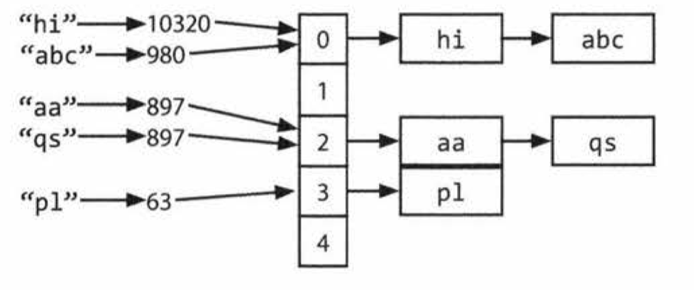

## Hash table
- A hash table is a data structure that maps keys to values for highly efficient lookup
- There are a number of ways of implementation.
- Simple implementation
  
  - Use an array of linked lists and a hash function.
  - To insert
    1. Compute the key's hash code
    2. Map the hash code to an index in the array. Two different hash codes could, of course, map to the same index.
    3. At this index, there is a linked list of keys and values. Store the key and value in this index. 
  - To retrieve
    1. Compute the key's hash code 
    2. Compute the index from the hash code.
    3. **Search through the linked list** for the value with this key.
  - If the number of collisions is very high, the worst case runtime is O(N).
  - For the good implementation, the lookup time is a O(1).
- Balanced binary search tree
  - This gives us an $O(\log{N})$ lookup time.
  - The advantage of this is potentially using less space, since we no longer allocate a large array.

## Java
- For Java, `array`s are fixed length. The size is defined when you create the array.
- When you need an array-like data structure that **offers dynamic resizing**, you would usually use an `ArrayList`.
- `ArrayList`
  - A typical implementation is that when the array is full, the array doubles in size.
  - Each doubling takes O(n) time, but happens so rarely that its amortized insertion time is still O(1).
    - Suppose you have an array of size N.
      - final capacity increase n/2 elements to copy
      - previous capacity increase: n/4 elements to copy
      - previous capacity increase: n/8 elements to copy
      - previous capacity increase: n/16 elements to copy
      - ...
      - second capacity increase: 2 elements to copy
      - first capacity increase: 1 element to copy
    - $\frac{N}{2} + \frac{N}{4} + \frac{N}{8} + ... + 2 + 1 < N$
  
- `String`
  ```java
  String joinWords(String[] words)
  {
    String sentence = "";
    for (String w : words) {
      sentence = sentence + w;
    }
    return sentence;
  }
  ``` 
  - On each concatenation, a new copy of the string is created.
  - The first iteration requires us to copy x characters, the second iteration requires copying 2x characters, and so on.
  - The total time therefore is $O(x + 2x + .. + nx) \approx O(xn^2)$.

- `StringBuilder`
  ```java
  String joinWords(String[] words) {
    StringBuilder sentence new StringBuilder();
    for (String w : words) {
      sentence.append(w);
    return sentence.toString();
  }
  ```
  - `StringBuilder` simply creates a resizable array of all the strings, copying them back to a **string only when necessary**.

## Python
- For python, array (`list`) are dynamic.
- If you need a length-fixed data type, use `tuple`.
- String
  - Use `str.join(arr)`: `''.join(sequenceofstrings)`
  - Use formatted string literals `f'http://{domain}/{lang}/{path}'` 

## C++
- For C++, `array`s are fixed length.
- If you need a length-fixed data type, use standard library `array` or `vector`.

## Problems
1. Is Unique: Implement an algorithm to determine if a string has all unique characters. What if you cannot use additional data structures?
     - Ask your interviewer **if the string is an ASCII string or a Unicode string.** 
     - If it's an ASCII string, **there could be 128 or 256 characters**.

2. Check Permutation: Given two strings, write a method to decide if one is a permutation of the other. 
     - Ask if they're ASCII string.
     - Ask if the comparison is **case sensitive**: is "God" the permutation of "dog"?
     - Ask if the **whitespace** should be compared too

3. URLify: Write a method to replace all spaces in a string with '%20: You may assume that the string has sufficient space at the end to hold the additional characters, and that you are given the **"true" length of the string**. (Note: If implementing in Java, please use a character array so that you can perform this operation in place.)
    - Example
      - Input: "≤", 13
      - Output:  "Mr%20John%20Smith"

4. Palindrome Permutation: Given a string, write a function to check if it is a permutation of a palindrome. A palindrome is a word or phrase that is the same forwards and backwards. A permutation is a rearrangement of letters. The palindrome does not need to be limited to just dictionary words.
    - EXAMPLE
      - Input: Tact Coa
      - Output: True (permutations: "taco cat", "atco cta" . etc.)

5. There are three types of edits that can be performed on strings: insert a character, remove a character, or replace a character. Given two strings, write a function to check if they are one edit (or zero edits) away.
    - Example 
      - pale, ple -> true
      - pales, pale -> true
      - pale, bale -> true
      - pale, bake -> false

6. String Compression: Implement a method to perform basic string compression using the counts of repeated characters. For example, the string aabcccccaaa would become a2b1c5a3. If the "compressed" string would not become smaller than the original string, your method should return the original string. You can assume the string has only uppercase and lowercase letters (a - z).

7. **Rotate Matrix**: Given an image represented by an NxN matrix, where each pixel in the image is 4 bytes, write a method to rotate the image by 90 degrees. Can you do this in place?

8. Zero Matrix: Write an algorithm such that if an element in an MxN matrix is 0, its entire row and column are set to 0.

9. Assume you have a method **isSubstring** which checks if one word is a substring of another. Given two strings, s1 and s2, write code to check if s2 is a rotation of s2 using **only one call to isSubstring** (e.g., " waterbottle" is a rotation of" erbottlewat" ).