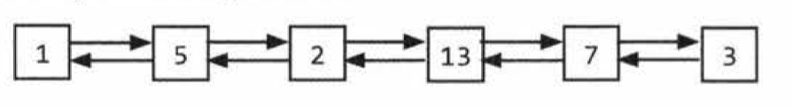
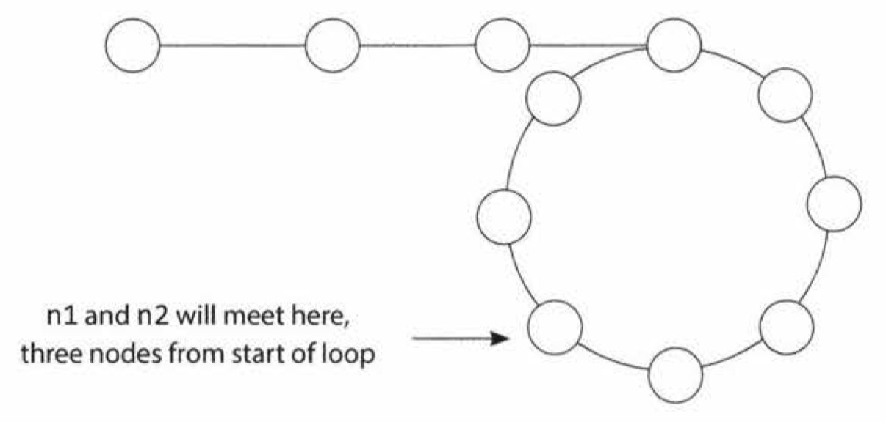

## Linked List
- A linked list is a data structure that represents a sequence of nodes.
  - In a *singly linked list*, each node points to the next node in the linked list.
  - A doubly linked list gives each node pointers to both the next node and the previous node.

- Unlike an array, a linked list does not provide constant time access to a particular "index" within the list.
- The benefit of a linked list is that you can add and remove items from the beginning of the list in constant time.
```Java
class Node {
  Node next = null;
  int data;
  
  public Node( int d) {
    data = d;
  }

  void appendToTail(int d) {
    Node end = new Node(d);
    Node n = this;
    while (n.next != null) {
      n = n.next;
    }
    n. next = end;
  }
}
```
- In this implementation, we don't have a `LinkedList` data structure. We access the linked list through a reference to the `head` Node of the linked list.
- What if multiple objects need a reference to the linked list, and then the head of the linked list changes? Some objects might still be pointing to the old head.
- We could, if we chose, implement a `LinkedList` class that wraps the `Node` class. This would essentially just have a single member variable: the `head` Node.
```Java
Node deleteNode(Node head, int d) {
  Node n = head;

  if (n .data == d)
  {
    return head next; /* moved head */
  }

  while (n.next != null) {
    if (n.next.data == d) {
      n.next = n. next.next;
      return head; /* head didn't change */
    }
    n = n.next;
  }

  return head;
}
```
- If the list is doubly linked, we must also update `n.next` to set `n.next.prey` equal to `n.prev`.
- The important things to remember are
  1. to check for the null pointer
  2. to update the head or tail pointer as necessary.
- if you implement this code in C, C++ or another language, you should consider i**f the removed node should be deallocated**.

## Technique
- **Runner**
  - The runner technique means that you iterate **through the linked list with two pointers** simultaneously, with one ahead of the other.
  - For example
    - you're asked to rearrange a linked list `a1 -> a2 -> .,, -> an -> b1 -> b2 -> ... -> bn` (even nodes) into `a1 -> b1 -> a2 -> b2 -> ... -> an -> bn` (first-half and second half are interweaved),
    - You could have one pointer `p1` (the fast pointer) **move every two elements** for everyone move that `p2` makes. When `p1` hits the end of the linked list, `p2` will be at the midpoint. Then, move pl back to the front and begin "weaving" the elements.
- Recursive Problems
  - A number of linked list problems rely on recursion.
  - If you're having trouble solving a linked list problem, you should explore if a recursive approach will work
  - Uou should remember that recursive algorithms take at least O(n) space, where n is the depth of the recursive call.

## Questions
1. Write code to remove duplicates from an unsorted linked list. FOLLOW UP: How would you solve this problem if a temporary buffer is not allowed?

2. Return Kth to Last: Implement an algorithm to find the kth to last element of a singly linked list. 
  - For example: 1 -> 2 -> 3 -> 4 -> 5
    - k = 1, the algorithm will return the last element. (5)
    - k = 2, the algorithm will return the last to second element (4)
  
3. Delete Middle Node: Implement an algorithm to delete a node in the middle (i.e., any node but the first and last node, not necessarily the exact middle) of a singly linked list, given only access to that node.
  - EXAMPLE
    - Input: the node c from the linked list a -> b -> c -> d -> e -> f
    - Result: nothing is returned, but the new linked list looks like a -> b -> d -> e -> f
  
4. Write code to partition a linked list around a value x, such that all nodes less than x come before all nodes greater than or equal to x. lf x is contained within the list, the values of x only need to be after the elements less than x (see below). The partition element x can appear anywhere in the "right partition"; it does not need to appear between the left and right partitions.
  - EXAMPLE
    - Input: 3 -> 5 -> 8 -> 5 -> 10 -> 2 -> 1 [partition = 5]
    - Output: 3 -> 1 -> 2 -> 10 -> 5 -> 5 -> 8

5. Sum Lists: You have two numbers represented by a linked list, where each node contains a single digit. The digits are stored in reverse order, such that the 1's digit is at the head of the list. Write a function that adds the two numbers and returns the sum as a linked list. **FOLLOW: Suppose the digits are stored in forward order.**
  - EXAMPLE
    - Input: (7 -> 1 -> 6) + (5 -> 9 -> 2) .That is, 617 + 295.
    - Output: 2 -> 1 -> 9. That is, 912
  - FOLLOW EXAMPLE
    - Input: (6 -> 1 -> 7) + (2 -> 9 -> 5) .That is, 617 + 295.
    - Output: 9 -> 1 -> 2. That is, 912

6. Palindrome: Implement a function to check if a linked list is a palindrome.

7. Intersection: Given two (singly) linked lists, determine if the two lists intersect. Return the intersecting node. Note that the intersection is defined based on reference, not value. That is, if the kth node of the first linked list is the exact same node (by reference) as the jth node of the second linked list, then they are intersecting.

8. **Loop Detection**: Given a circular linked list, implement an algorithm that returns the node at the beginning of the loop.
    - This is a modification of a classic interview problem: detect if a linked list has a loop. Let's apply the **Pattern Matching approach**.
    - **Detect If Linked List Has A Loop**
      - Using the FastRunner / SlowRunner approach, they must eventually meet.
      - That's not possible to miss forever. Suppose that FastRunner did hop over SlowRunner, such that SlowRunner is at spot i and FastRunner is at spot i + 1. In the previous step, SlowRunner would be at spot i - 1 and FastRunner would at spot ((i + 1) - 2), or spot i - 1.That is, they would have collided.
    - When Do They Collide?
      - Assume that the linked list has a "non-looped" part of size k. Node k is where the loop start.
      - When SlowRunner takes k steps, FastRunner takes 2k steps. In other words, FastRunner is $2k - k = k$ steps into the loop. However, k could be larger than the loop size. Thus, we define a new variable $K = k \mod \text{LOOP\_SIZE}$
      - After the node k, SlowRunner and FastRunner begin to close each other with each steps.
       
      - SlowRunner will meet Faster after LOOP_SIZE - K steps.
    - How Do You Find The Start of the Loop?
      - We now know that **CollisionSpot** is K nodes before the start of the loop.
      - Therefore, **both CollisionSpot and LinkedListHead are k nodes from the start of the loop.**
      - Now, if we keep one pointer at CollisionSpot and move the other one to LinkedListHead, they will each be k nodes from LoopStart. Moving the two pointers at the same speed will cause them to collide again at **LoopStart**.