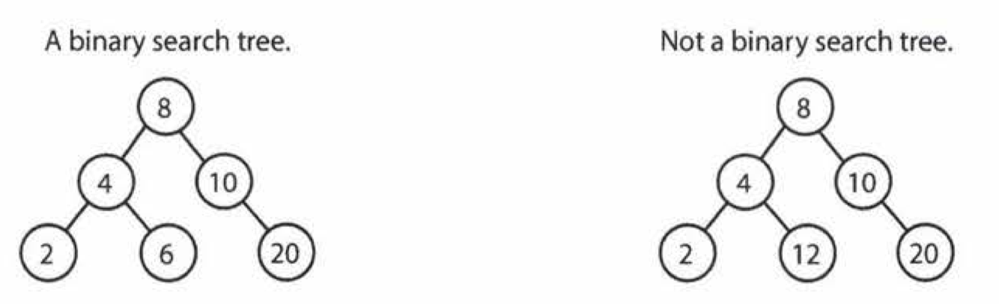
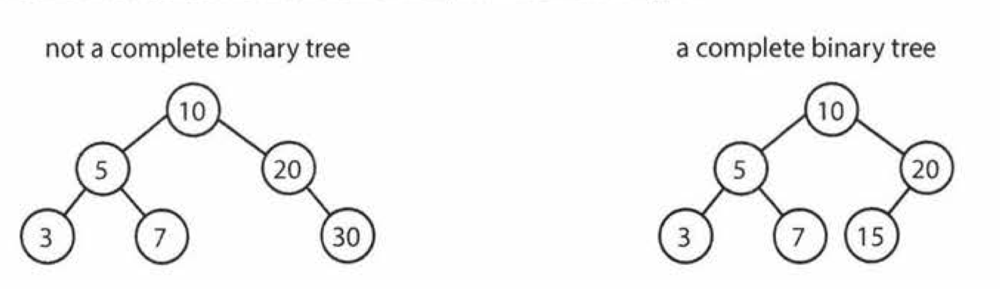
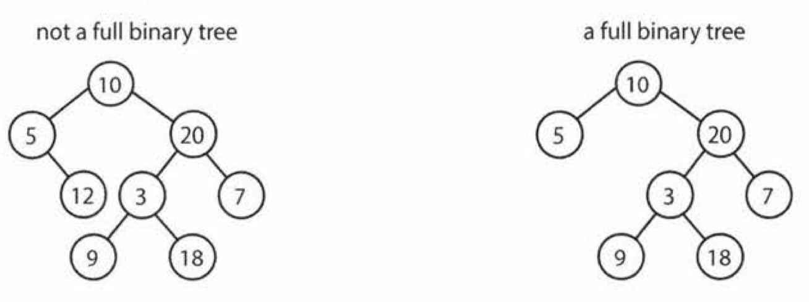
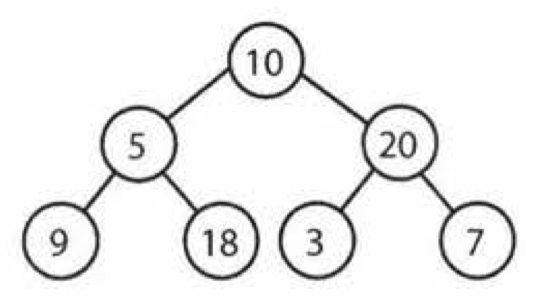
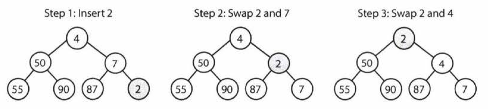
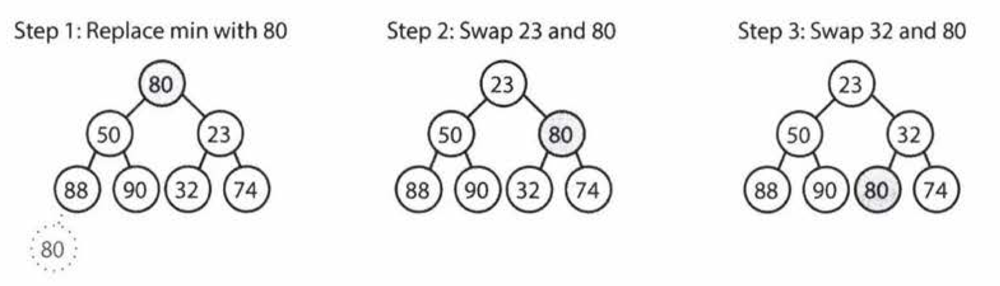
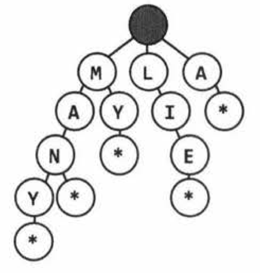
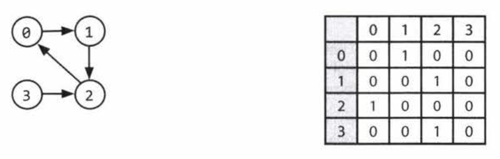
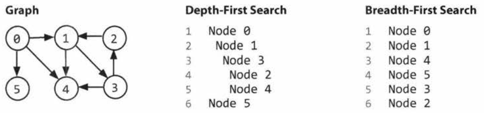

## Tree
- A tree is actually a type of graph.
- A tree is a data structure composed of *nodes*.
  - Each tree has a root node.
  - The root node has zero or more child nodes.
  - Each child node has zero or more child nodes, and so on.
- The tree cannot contain cycles.
- A node is called a *leaf* if it has no children.
```java
class Node {
  public String name;
  public Node[] children;
}
``` 
- You might also have a `Tree` class to wrap this node, but it rarely simplify interview questions.
***
- Trees vs. Binary Trees
  - A binary tree is a tree in which each node has *up to two children*.
  - There are occasions when you might have a tree that is not a binary tree. For example, suppose you were using a tree to represent a bunch of phone numbers.
- Binary Tree vs. Binary Search Tree
  - A binary search tree is a binary tree in which every node `n` satisfy: `all descendants <= n < all right descendants`.
    - Under some definitions, the tree cannot have duplicate values.
    - In others, the duplicate values will be on the right or can be on either side.
    - You should clarify with your interviewer.
  - A binary search tree imposes the condition that, for each node, its left descendants are less than or equal to the current node, which is less than the right descendants.
  
  - The tree on the right is not a search tree, since `12` is to the left of `8`.
***
- Balanced vs. Unbalanced
  - Balancing a tree does not mean the left and right subtrees are exactly the same size.
  - A "balanced" enough tree ensure **$O(\log{n})$ times for `insert` and `find`**.
  - Two common types of balanced trees are **red-black trees** and **AVL trees**.
- Complete Binary Trees
  
  - A complete binary tree is a binary tree in which every level of the tree is fully filled.
  - To the extent that the last level is filled, it is filled left to right.
- Full Binary Trees
  
  - A full binary tree is a binary tree in which every node has either zero or two children
  - That is, no nodes have only one child.
- Perfect Binary Trees
  
  - A perfect binary tree is one that is both full and complete.
  - Every level has the maximum number of nodes. Perfect tree must have exactly $2^k - 1$ nodes (where k is the number of levels).
  - Perfect trees are **rare in interviews and in real  life**. Do not assume a binary tree is perfect.
***
- Binary Tree Traversal
  - Prior to your interview, you should be comfortable implementing *in-order*, *post-order*, and *pre-order traversal*.
  - In-Order Traversal
    ```java
    void inOrderTraversal(TreeNode node) {
      if (node != null) { 
        inOrderTraversal(node.left);
        visit(node);
        inOrderTraversal(node.right);
      }
    }
    ``` 
    - In-order traversal means to "visit" the left branch, then the current node, and finally, the right branch.
    - When performed on a binary search tree, **it visits the nodes in ascending order**.
  - Pre-Order Traversal
    ```java
    void preOrderTraversal((TreeNode node) {
      if (node != null) { 
        visit(node);
        preOrderTraversal(node.left);
        preOrderTraversal(node.right);
      }
    }
    ```  
    - Pre-order traversal visits the current node before its child nodes.
    - In a pre-order traversal, **the root is always the first node visited**.
  - Post-Order Traversal
    ```java
    void postOrderTraversal(TreeNode((TreeNode node) {
      if (node != null) { 
        postOrderTraversal(TreeNode(node.left);
        postOrderTraversal(TreeNode(node.right);
        visit(node);
      }
    }
    ```  
    - In a post-order traversal, **the root is always the last node visited**.

## Heap (Min-Heaps and Max-Heaps)
- A min-heap is a complete binary tree where each node is smaller than its children.
- The root is the minimum element in the min-heap There.
- Heap is not a binary search tree since it does not guarantee whether the right node is larger than the left node.
- There ar e two key operations on a min-heap: `insert` and `extract_min`.
  - Insert
     
    1. We always start by **inserting the element at the bottom** to maintain the complete tree property.
    2. We "fix" the tree by swapping the new element with its parent. We essentially bubble up the minimum element.
    3. This takes $O(\log{n})$ time, where n is the number of nodes in the heap.
  - Extract Minimum Element 
     
    - Finding the minimum element of a min-heap is easy: it's always at the top.
    - The trickier part is how to remove it.
    - Algorithm:
      1. We remove the minimum element and **swap it with the last element** in the heap.
      2. We bubble down this element, swapping it with one of its children until the minheap property is restored
         - Swapping it with the left child or the right child depends on their values.
         - You'll need to take the smaller one in order to maintain the min-heap ordering.
    - This algorithm will also take $O(\log{n})$ time.

- Max-heaps are essentially equivalent, but the elements are in descending order rather than ascending order.

## Trie (Prefix Tree)
- It comes up a lot in interview questions, but algorithm textbooks don't spend much time on this data structure.
 
- A trie is a variant of an **n-ary tree** in which **characters are stored** at each node.
- Each path down the tree may represent a word.
- The `*` nodes are often used to indicate complete words.
  - `*` nodes might be a special type of child, such as a `TerminatingTrieNode`.
  - We could use just a `boolean` flag terminates within the "parent" node.
- A node in a trie could have anywhere from 1 through ALPHABET_SIZE + 1 children.
- Very commonly, **a trie is used to store the entire (English) language for quick prefix lookups**.
  - A hash table cannot tell us if a string is a prefix of any valid words.
  - A trie can check if a string is a valid prefix in O(K) time, where K is the length of the string.
  - A hash table must read through all the characters in the input, which takes (K) time in the case of a word lookup.
- **Many problems involving lists of valid words leverage a trie as an optimization**.

## Graph
- A graph is simply a collection of nodes with edges between (some of) them.
  - Graphs can be either **directed** or **undirected**. While directed edges are like a one-way street, undirected edges are like a two-way street.
  - The graph might consist of multiple isolated subgraphs.
  - If there is a path between every pair of vertices, it is called a "connected graph'.
  - The graph can have cycles. An "acyclic graph" is one without cycles.
- A tree is actually a type of graph: a connected graph without cycles.
- There are two common ways to represent a graph:
  - **Adjacency List** 
    ```java
    class Graph {
      public Node[] nodes;
    }

    class Node {
      public String name;
      public Node [] children;
    }
    ``` 
    - This is the most common way.
    - Every vertex **stores a list of adjacent vertices**.
    - In an undirected graph, an edge like `(a, b)` would be stored twice
    - The `Graph` class is used because we can't necessarily reach all the nodes from a single node.
  - **Adjacency Matrices**
    
    - An adjacency matrix is an NxN boolean matrix, where N is the number of nodes.
    - `matrix[i][j] == true` indicates an edge from node i to node j.
    - In an undirected graph, an adjacency matrix will be symmetric.
    - The same graph algorithms used on adjacency lists can be performed with adjacency matrices, but they may be somewhat less efficient.

- The two most common ways to search a graph are
  
  - **Depth-first search (DFS)**
    - We start at the root and explore each branch completely before moving on to the next branch.
    - DFS is often preferred if we want to **visit every node** in the graph.
    - Pre-order and other forms of **tree traversal are a form of DFS**.
    - For a graph, we must check if the node has been visited. If we don't, we risk getting stuck in an infinite loop.
    ```
    void search(Node root) {
      if (root == null) return;
      visit(root);
      root.visited = true;
      for each (Node n in root.adjacent)
        if (n.visited == false) {
          search(n);
        }
      }
    }
    ``` 
  - **Breadth-first search (BFS)**
    - We start at the root and explore each neighbor before going on to any of their children
    - If we want to **find the shortest path** (or just any path) between two nodes, BFS is generally better.
    - BFS is a bit less intuitive. The main tripping point is the (false) assumption that BFS is recursive.
    - **BFS uses uses a queue**.
    ```java
    void search(Node root) {
      Queue queue = new Queue();
      root.marked = true;
      queue.enqueue(root); // Add to the end of queue

      while (!queue.isEmpty()) {
        Node r = queue.dequeue(); // Remove from the front of the queue
        visit(r);
        foreach (Node n in r.adjacent) {
          if (n.marked == false) {
            n.marked = true;
            queue.enqueue(n);
          }
        }
      }
    }
    ``` 

- Bidirectional Search
  - Bidirectional search is used to **find the shortest path between a source and destination node**.
  - It operates by essentially running **two simultaneous breadth-first searches**.
  - When their searches collide, we have found a path.
  - Big O analysis
    - Consider a graph where every node has at most k adjacent nodes and the shortest path from node s to node t has length d.
    - In traditional breadth-first search, we would search up to k nodes every level. We would do this d times, so that's a $O(k^d)$ nodes.
    - In bidirectional search, we have two searches that collide after approximately $\frac{d}{2}$ levels. Thus, there are $O(2k^{d/2}) = O(k^{d/2})$ nodes to search.
    - Recall that $k^{d/2} \times k^{d/2} = k^d$. The bidirectional search is actually faster by a factor of $k^{d/2}$.

## Questions
- The worst case and average case time may vary wildly, and we must evaluate both aspects of any algorithm.
- Fluency in implementing a tree or graph from scratch will prove essential.
- Some of **the terms can vary** slightly across different textbooks. Make sure to clear up any ambiguity with your interviewer.

1. Route Between Nodes: Given a directed graph, design an algorithm to find out whether there is a route between two nodes.

2. Minimal Tree: Given a sorted (increasing order) array with unique integer elements, write an algorithm to create a binary search tree with minimal height.

3. List of Depths: Given a binary tree, design an algorithm which creates a linked list of all the nodes at each depth (e.g., if you have a tree with depth 0, you'll have 0 linked lists).

4. Check Balanced: Implement a function to check if a binary tree is balanced. For the purposes of this question, a balanced tree is defined to be a tree such that the heights of the two subtrees of any node never differ by more than one.