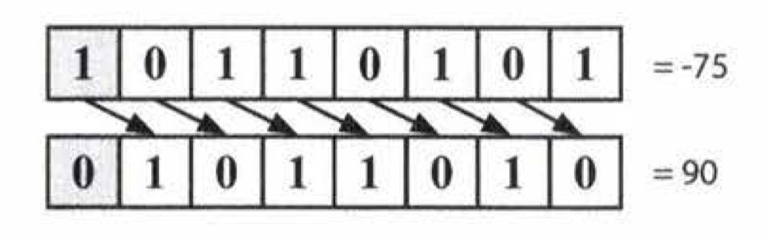
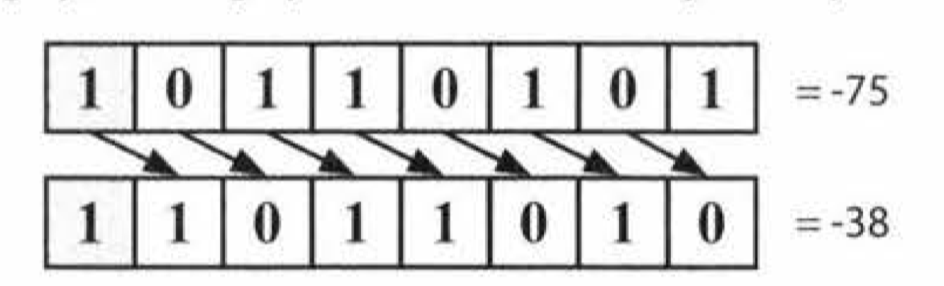

## Bit Manipulation
- `^` indicates an XOR
- `~` is a NOT
- To understand these expressions, recall that these operations occur bit-by-bit.

|                    |                    |                         |
|--------------------|--------------------|-------------------------|
| 0110 + 0010 = 1000 | 0011* 0101 = 1111  | 0110 + 0110 = 1100      |
| 0011 + 0010 = 0101 | 0011 * 0011 = 1001 | 0100 * 0011 = 1100      |
| 0110 - 0011 = 0011 | 1101 >> 2 = 0011   | 1101 ^ (~1101) = 1111   |
| 1000 - 0110 = 0010 | 1101 ^ 0101 = 1000 | 1011 & (~0 << 2) = 1000 |

- 0110 + 0110 is equivalent to 0110 * 2.
- The solution to a ^ (~a) will be a sequence of 1s.
- ~0 is a sequence of 1s, so ~0 << 2 is 1s followed by two Os.

|             |            |              |
|-------------|------------|--------------|
| x ^ 0s = x  | x & 0s = 0 | x \| 0s = x  |
| x ^ 1s = ~x | x & 1s = x | x \| 1s = 1s |
| x ^ x = 0   | x & x = x  | x \| x = x   |

The followed expressions are useful in bit manipulation

## Two's Complement
- Computers typically store integers in *two's complement representation*.
- The two's complement of an N-bit number (where N is the number of bits excluding the sign bit) is the complement of the number with respect to $2^N$

| Positive | Values | Negative | Values |
|----------|--------|----------|--------|
| 7        | 0 111  | -1       | 1 111  |
| 6        | 0 110  | -2       | 1 110  |
| 5        | 0 101  | -3       | 1 101  |
| 4        | 0 100  | -4       | 1 110  |
| 3        | 0 011  | -5       | 1 011  |
| 2        | 0 010  | -6       | 1 010  |
| 1        | 0 001  | -7       | 1 001  |
| 0        | 0 000  |          |        |

- Take 4-bit integer -3 as an example
  - We want the **complement with respect to 2^3**, which is 8
  - The complement of 3 with respect to 8 is 5 (101)
  - Therefore, -3 in binary as a 4-bit number is 1101,
- -K as a N-bit number is: concat (1, $2^{K+1} - K)$
- **-K = ~K + 1**
  - -1 = ~(0001) + 1 = 1111
  
- There are two types of right shift operators
  - The *arithmetic* right shift.
  - The *logical* right shift.

- In a logical right shift, we shift the bits and put a 0 in the most significant bit.
```java
int repeatedLogicalShift(int x, int count) {
  for(inti=e;i<count;i++){
    x >>>= 1; // Arithmetic shift by 1
  }
  return x
}
```

 
- In an arithmetic right shift, we shift values to the right but fill in the new bits with the value of the sign bit.
```java
int repeatedArithmeticShift(int x, int count) {
  for(inti=e;i<count;i++){
    x >>= 1; // Arithmetic shift by 1
  }
  return x
}
``` 

## Common Bit Tasks: Getting and Setting
- The following operations are very important to know, but do not simply memorize them
- **Get Bit**
  - We create a value that looks like 00010000. By performing an **AND** with num, we clear all bits other than the bit at bit i.
  - Finally, we compare that to 0. If that new value is not zero, then bit i must have a 1.
  ```java 
  boolean getBit(int num, int i) {
    return (num & (1 << i)) != 0;
  }
  ```
- **Set Bit**
  - We shifts 1 over by i bits, creating a value like 00010000.
  - By performing an **OR** with num, only the value at bit i will change.
  ```java
  int setBit(int num, int i) {
    return num || (1 << i);
  }
  ``` 

- **Clear Bits**
  - We create a number like 11101111 by creating the reverse of it (00010000) and negating it.
  - Then, we perform an **AND** with num. This will clear the ith bit.
  ```java
  int clearBit(int num, int i) {
    int mask = ~(1 << i);
    return num & mask;
  }
  ``` 
  - To clear all bits from the most significant bit through i (inclusive), we create a mask with a 1 at the ith bit.
  - Then, **we subtract 1 from it**, giving us a sequence of 0s followed by 1s.
  - We then **AND** our number with this mask to leave just the last i bits
  ```java
  int clearBitsMSBthroughI(int num, int i) {
    int mask = (1 << i) - 1;
    return num & mask;
  }
  ``` 
  - To clear all bits from i through 0 (inclusive), we take **a sequence of all 1s (which is -1)** and shift it left by i + 1 bits.
  ```java
  int clearBitslthrough0(int num, int i) {
    int mask = (-1 << (i + 1));
    return num & mask;
  }
  ```  

- **Update Bit**
  - To set the ith bit to a value v, we first clear the bit at position i by using a mask that looks like 11101111.
  - Then, we shift the intended value, v, left by i bits.
  - Finally, we **OR** these two numbers, updating the ith bit
  ```java
  int updateBit(int num, int i, boolean bitIsl) {
    int value = bitIsl ? 1 : 0;
    int mask = ~(1 << i);
    return (num & mask) | (value << i);
  }
  ``` 