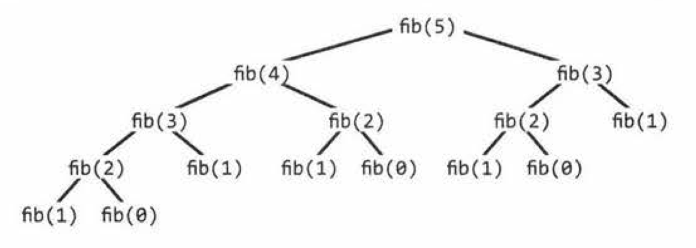
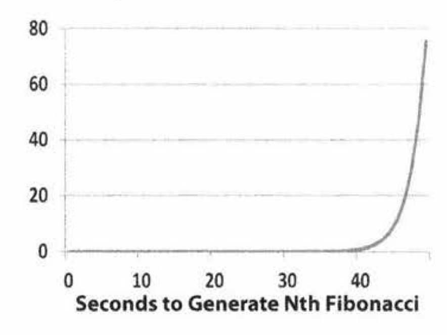
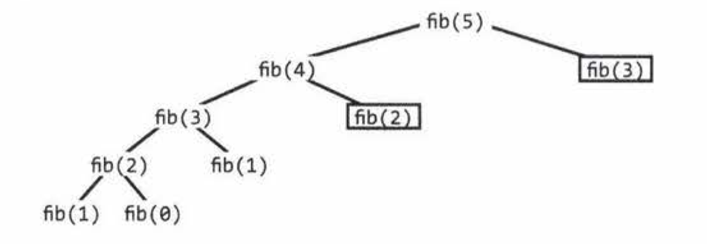

## Recursion
- When you hear a problem beginning with the following statements, it's often a good candidate for recursion: "Design an algorithm to **compute the nth** .. :; "Write code to **list the first n** .. :; "Implement a method to compute all..:; and so on.
- Recursive solutions, by definition, are built off of solutions to subproblem.
  - Compute f(n) by adding something, removing something, or otherwise changing the solution for f (n -1) .
  - Might solve the problem for the first half of the data set, then the second half, and then merge those results.
- Three of the most common approaches to develop an algorithm are
  - *Bottom-up*
    - The bottom-up approach is often the most intuitive.
    - Figure out how to solve the problem for two elements, then for three elements, and so on.
  - *Top-down*
    - The top-down approach can be more complex since it's less concrete.
    - In these problems, we think about how we can **divide the problem for case N into subproblems.**. *Be careful of overlap* between the cases.
  - *Half-and-half*.
    - For example, binary search works with a "half-and-half" approach.
    - Merge sort is also a "half-and-half" approach. We sort each half of the array and then merge together the sorted halves.

- Recursive vs. Iterative Solutions
  - Recursive algorithms can be very space inefficient.
    - Each recursive call adds a new layer to the stack
    - If your algorithm recurses to a depth of n, it uses at least `O(n)` memory.
  - It's often better to implement a recursive algorithm iteratively. **All recursive algorithms can be implemented iteratively,**
  - Before diving into recursive code, ask yourself how hard it would be to implement it iteratively, and discuss the tradeoffs with your interviewer.

## Dynamic Programming & Memoization
- Once you get the hang of dynamic programming problems, these can actually be very easy problems.
- Dynamic programming is mostly just a matter of **taking a recursive algorithm and finding the overlapping subproblems** (that is, the repeated calls). You then cache those results for future recursive calls.
- Terminology: Some people call top-down dynamic programming "*memoization*" and only use "*dynamic programming*" to refer to bottom-up work

- Fibonacci Numbers
  - One of the simplest examples of dynamic programming is computing the nth Fibonacci number.
  - A good way to approach such a problem is often to implement it as a normal recursive solution, and then add the caching part.
  ```java
  int fibonacci(int i) {
    if ( i == e) return e; 
    if ( i == 1) return 1;
    
    return fibonacci(i - 1) + fibonacci(i - 2);
  }
  ``` 
  
  - **Drawing the recursive calls as a tree is a great way to figure out the runtime of a recursive algorithm.**
  - The total number of nodes in the tree will represent the runtime, since each call only does `O(1)` work outside of its recursive calls. Therefore, the number of calls is the runtime.
  - The root node has two children. Each of those children has two children.
  - If we do this `n` times, we'll have roughly $O(2^n)$ nodes. **This gives us a runtime of roughly $O(2^n)$.**
    - But since the right and left subtrees are not the same size, the true runtime is closer to $O(1.6^n)$.
    - Saying $O(2^n)$ is still technically correct though as it describes an upper bound on the runtime.
  


- Top-Down Dynamic Programming (or Memoization)
  - Study the recursion tree. Where do you see identical nodes?
  - In fact, when we call fib(n), we shouldn't have to do much more than O(n) calls, since there's only O(n) possible values we can throw at fib.
  - **Each time we compute fib (i), we should just cache this result and use it later.**
  ```java
  int fibonacci(int n) { 
    return fibonacci(n, new int[n + 1]);
  }

  int fibonacci(int i, int[] memo) {
    if (i == 0 || i == 1) return i;

    if (memo[i] === 0) {
      memo[i] = fibonacci(i - 1, memo) + fibonacci(i - 2, memo);
    }
    return memo[i];
  }
  ```
  .
  - Each node of those nodes has one other child, resulting in roughly `2n` children in the tree. This gives us a runtime of `O(n)`.

- Bottom-Up Dynamic Programming
  - Think about doing the same things as the recursive memoized approach, but in reverse.
  ```java
  int fibonacci(int n) {
    if (n == 0) return 0;
    else if (n == 1) return 1;

    int[] memo = new int[n];
    memo[0] = 0
    memo[1] = 1;
    for (int i = 2; i < n; i++) {
      memo[i] = memo[i - 1] + memo[i - 2];
    }

    return memo[n - 1] + memo[n - 2];
  }
  ``` 
  - We can get rid of the memo table and just store a few variables.
  ```java
  int fibonacci(int n) {
    if (n == 0) return 0;

    a = 0
    b = 1;
    for (int i = 2; i < n; i++) {
      int c = a + b;
      a = b;
      b = c;
    }

    return a + b;
  }
  ```

## Questions
1. Triple Step: A child is running up a staircase with n steps and can hop either 1 step, 2 steps, or 3 steps at a time. Implement a method to count how many possible ways the child can run up the stairs.

2. Robot in a Grid: Imagine a robot sitting on the upper left corner of grid with r rows and c columns. The robot can only move in two directions, right and down, but certain cells are "off limits" such that the robot cannot step on them. Design an algorithm to find a path for the robot from the top left to the bottom right.

3. Magic Index: A magic index in an array `A[0 ... n -1]` is defined to be an index such that `A[i] = i`. Given a sorted array of distinct integers, write a method to find a magic index, if one exists, in array A. **FOLLOW UP** What if the values are not distinct?

4. Power Set: Write a method to return all subsets of a set.

5. Recursive Multiply: Write a recursive function to multiply two positive integers without using the * operator. You can use addition, subtraction, and bit shifting, but you should minimize the number of those operations.